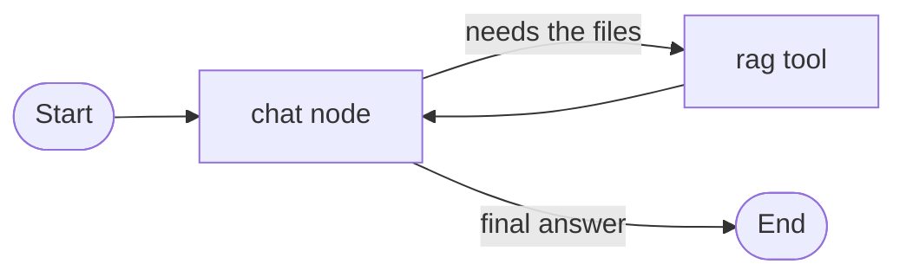

# RAG Generator

A small chat app for asking questions about uploaded PDFs and text files. You add documents while the app is running. A different set of files does not require a code change.

Upload `.txt`, `.md`, or `.pdf` files, then ask in the same conversation. Answers come from those files. If the files do not contain the answer, the agent says it does not know.

## Agent state

The graph uses our own `MessageState` in `app/graph.py`. It is not LangGraph's prebuilt `MessagesState`. The state has one field:

```python
class MessageState(TypedDict):
    messages: Annotated[list[BaseMessage], add_messages]
```

`messages` is the whole conversation. `add_messages` appends each new turn instead of replacing the list, so a follow-up still has the earlier question. Tool-call messages stay inside the graph while it is working. `ask` returns only the human messages and the final assistant text.

Each chat in the sidebar is a separate thread. `MemorySaver` stores that thread in memory until the process stops. There is one module-level `thread_id`, and it always points at the chat you have open. Selecting another chat switches that id. Nothing about the conversation is written to Postgres or SQLite.

## How the agent works

You upload an AWS invoice and ask, "What is the total AWS bill?"

1. The question is appended to `MessageState`.
2. The chat node places a short system message in front of the thread: answer from the uploaded documents, use the rag tool, and say you don't know when the documents do not have the answer. It then binds `rag_tool` and calls the model.
3. The model calls `rag_tool` with a search query.
4. The tool runs a Chroma similarity search (`k` = 4) and returns the source filename plus the matching passage. If nothing is stored, it returns a short line that says so.
5. Control goes back to the chat node. The model writes the answer from those passages. If the files do not contain the fact, it says it does not know.

A second question in the same chat is appended to the same `messages` list, so the model still sees the first turn.



## Documents

Every file goes through the same path. PDFs are read with `PyPDFLoader`. Text and Markdown are read as UTF-8. Text is split into chunks of 1000 characters with an overlap of 200. Each chunk is tagged with metadata `source` set to the filename and stored in one Chroma collection under `data/chroma`. The files themselves sit in `data/uploads`.

Uploading another file adds it beside the ones already stored. The open chat is not cleared. Uploading the same filename again deletes only the chunks whose source is that filename, then indexes the new copy. Any mix of txt, md, and pdf files works without editing the agent.

## Models

An OpenRouter API key is required. Put it in `.env` as `OPENROUTER_API_KEY`.

| Role | Model | Where it runs |
| --- | --- | --- |
| Chat | `nvidia/nemotron-3-ultra-550b-a55b:free` | OpenRouter, `https://openrouter.ai/api/v1`, temperature 0 |
| Embeddings | `BAAI/bge-small-en-v1.5` | This machine, through `HuggingFaceEmbeddings` |

Chat uses `langchain_openai.ChatOpenAI`. The embedding model is downloaded the first time a file is indexed.

## Files

- `main.py` starts the app.
- `app/graph.py` has `MessageState`, the agent, and `rag_tool`.
- `app/llm.py` creates the chat model and the embedding model.
- `app/store.py` reads files and adds their chunks to Chroma.
- `app/config.py` has the model name, paths, and chunk size.
- `templates/index.html` is the page.
- `PLAN.md` is the development plan.

## Setup

```bash
python3 -m venv .venv
source .venv/bin/activate
pip install -r requirements.txt
cp .env.example .env
uvicorn main:app --reload
```

Open http://127.0.0.1:8000.

## Screenshots

A question about an uploaded AWS invoice. Both invoice PDFs stay in the document list, and the chat is still there after the upload.


